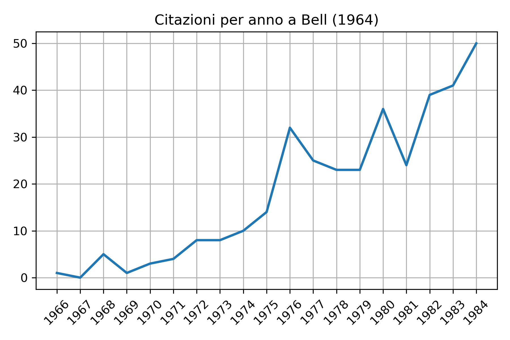

# Misurare l'Impatto della Produzione Scientifica. 
## Risultati di un'Indagine Bibliometrica sul Teorema di Bell. 

La repository contiene i codici scritti per la realizzazione del lavoro di tesi magistrale. Quest'ultimo è stato articolato intorno a due domande di ricerca fondamentali: 
1) La storia del Teorema di Bell ci racconta davvero una storia di completo disinteresse nei confronti del lavoro del fisico irlandese come molta letteratura sul tema lascia intendere? 
2) E possibile ottenere una visualizzazione della comunità di ricerca che si è interessata al risultato raggiunto da Bell nel 1964?

### Analisi Storica 
Rispondere alla prima domanda ha richiesto un lavoro quantitativo che prendesse come _input_ due differenti file **.csv** e offrisse come _output_ una serie di visualizzazioni che permettessero di ottenere a colpo d'occhio le informazioni necessarie. Lo script prodotto a tale scopo `Bell1.0.py` deve adattarsi alla differente struttura dei due file in _input_ che contengono i dati ottenuti da due differenti banche dati: 
- Per quanto riguarda i dati riguardanti le pubblicazioni successive al 1985 si è attinto al bacino di _Web of Science_
- Per quanto riguarda i dati riguardanti le pubblicazioni precedenti al 1985 si è, invece, fatto riferimento al database di _Google Scholar_

Questo permette di osservare l'andamento citazionale totale che coinvolge _On the Einstein Podolski Rosen paradox_, come anche di osservare la crescita di citazioni anno per anno. 

Si tenga presente che la raccolta di dati è stata effettuata a metà 2020. Per cui le citazioni relative a tale anno sono necessariamente incomplete. I dati mostrano come effettivamente c'è voluto del tempo prima che i risultati ottenuti da J.S. Bell venissero accettati come rilevanti dalla comunità scientifica. Per il lavoro di analisi necessaria per contestualizzare e spiegare i risultati raggiunti si è ritenuto utile comprendere, tra le altre cose, quali siano stati gli autori che hanno maggiormente citato il lavoro in esame o quali siano state le riviste scientifiche che hanno ospitato il maggior numero di cotributi sul tema. 

L'elenco completo delle visualizzazioni ottenute è disponibile sulla cartella [MEGA](https://mega.nz/folder/d1JmxTiT#5-59GtTFdo2mb1VVLjEG7A) dedicata.

### Analisi delle Comunità
La seconda domanda ha richiesto, invece, l'utilizzo di differenti algoritmi di _clustering_. Utilizzando _VOSViewer_ la comunità scientifica in esame è stata analizzata utilizzando come grado di somiglianza tra le pubblicazioni che compongono il _corpus_, il _bibliographic coupling_ e la _co-citation analysis_. 

Le visualizzazioni mostrate sono state rese possibili dalla completezza dei dati raccolti attraverso _Web of Science_, avendo a disposizioni le informazioni relative ai riferimenti bibliografici di ogni singola pubblicazione citante l'articolo di J.S. Bell. Per il _corpus_ di dati relativi ai documenti pubblicati precedentemente al 1964, invece, si è sfruttato il particolare approccio di **M. Gerlach** che ha proposto un nuovo approccio al [Topic Modeling](https://advances.sciencemag.org/content/4/7/eaaq1360.full)

il file `Sbmtm.py` contiene il codice modellato sul lavoro di Gerlach che permette di ottenere un grafo bipartito e gerarchicamente organizzato in grado di mostrare una suddivisione della comunità di ricerca in _cluster_ partendo dall'analisi linguistica dei singoli documenti. 

Per l'analisi e la lettura dei dati contenuti nell'immagine si è reso necessario accedere alle informazioni che esso contiene. Questo è stato fatto espandendo il contenuto di ogni nodo con il codice contenuto in `Topicmodeling.py` che esporta le informazioni in formato `.json`. Attraverso `Jsonanalyzer.py` il file `.json` è stato a sua volta stampato in immagine. Ogni nodo è stato tradotto in una matrice che mostrasse il legame diretto tra un _cluster_ di _topic_ e un _cluster_ di comunità

e in un istogramma che mostri i termini più rilevanti all'interno di ogni _cluster_ di _topic_.

